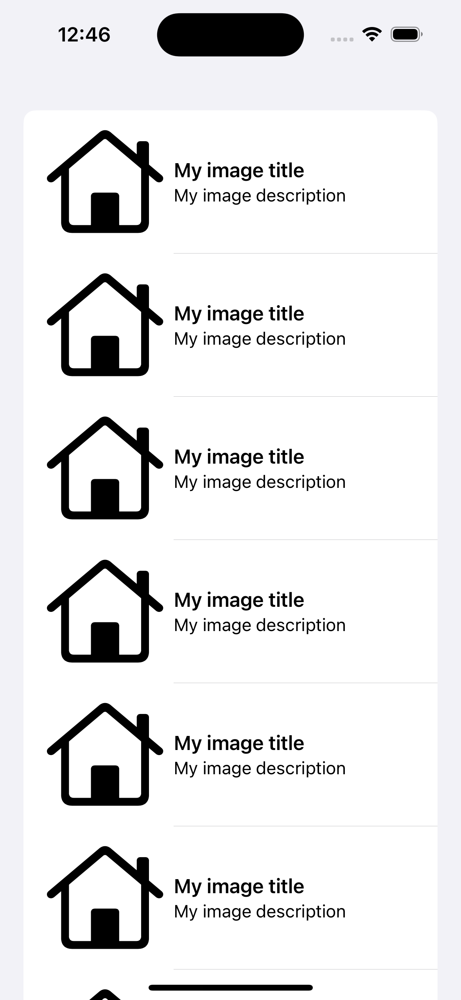

# Redacted

The redacted feature is used to hide the content in the name of palce holder 

## System requirement

<table><tbody><tr><td>Xcode Version</td><td>16.0</td></tr><tr><td>Minimum OS</td><td>15.0</td></tr><tr><td>SwuiftUI Version</td><td>&nbsp;</td></tr><tr><td>Swift Langauge Version</td><td>5</td></tr><tr><td>&nbsp;</td><td>&nbsp;</td></tr></tbody></table>

## Screen shots  
 
 

[] []

## Code snippert

```
View/List {        

}.redacted(reason: .placeholder)        
```
